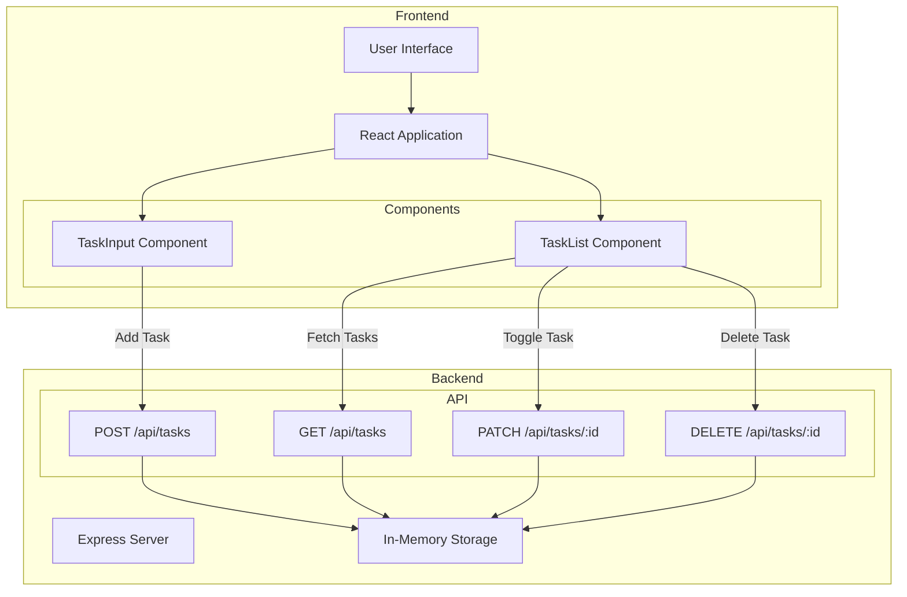
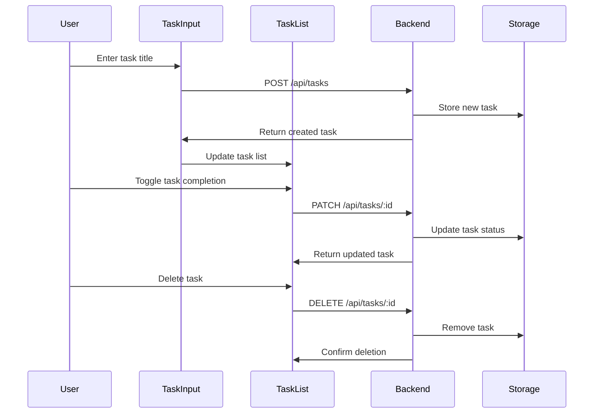
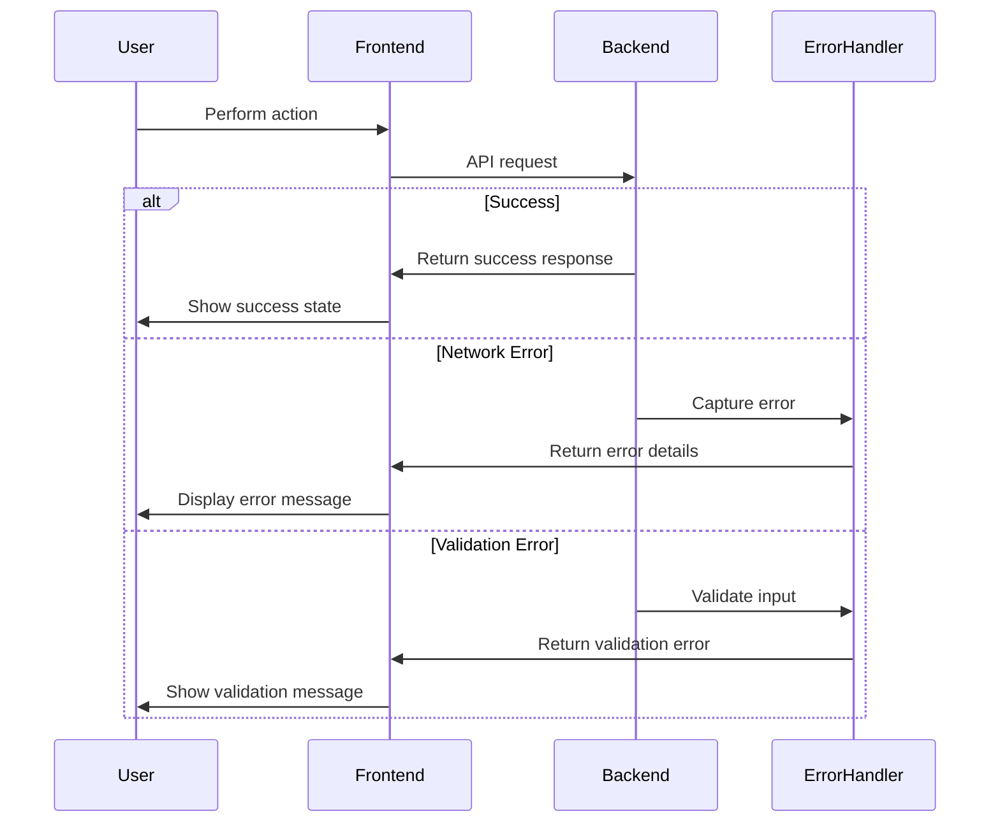
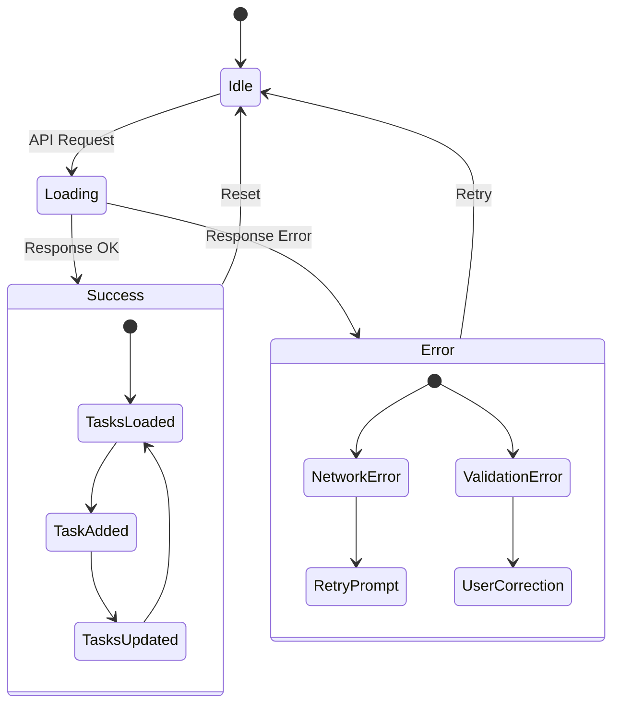
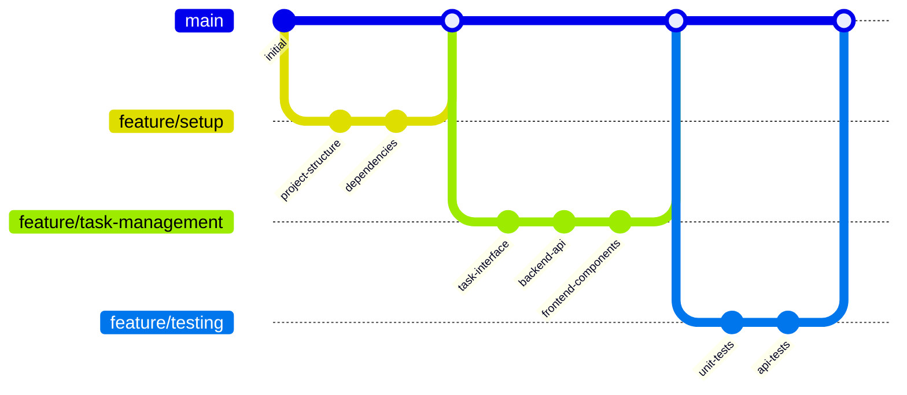
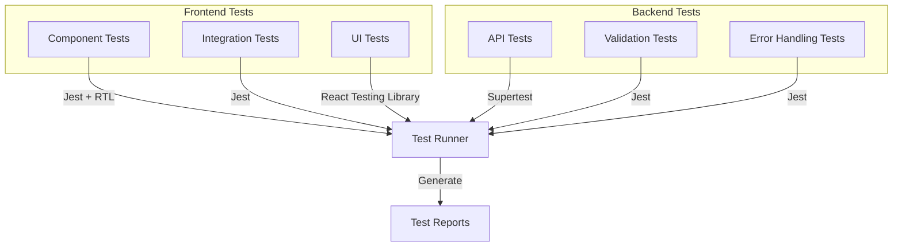
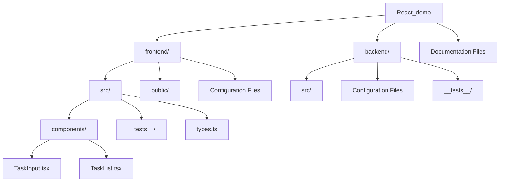

# Task Management Application Workflow

## Architecture Overview

## Component Interaction Flow

## Error Handling Flow

## State Management Flow

## Development Workflow

## Testing Architecture

## Directory Structure

